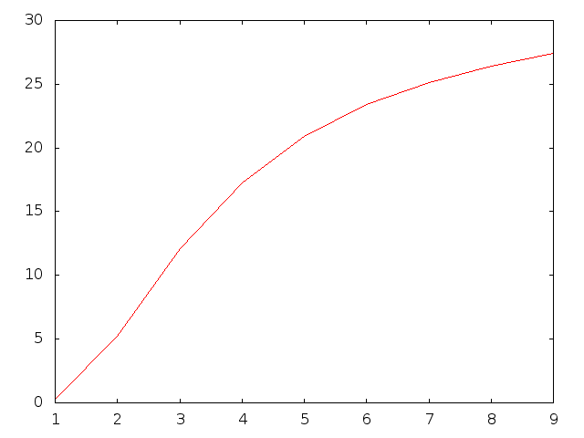
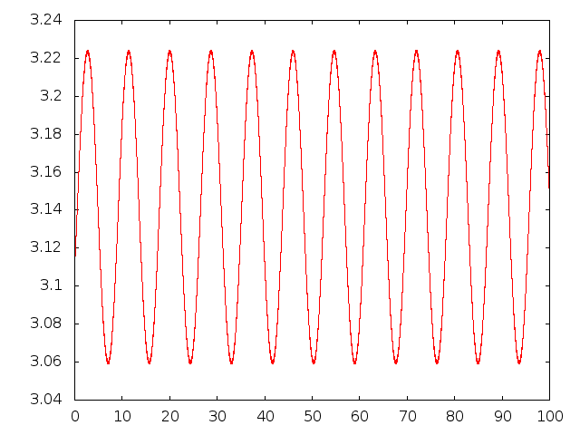
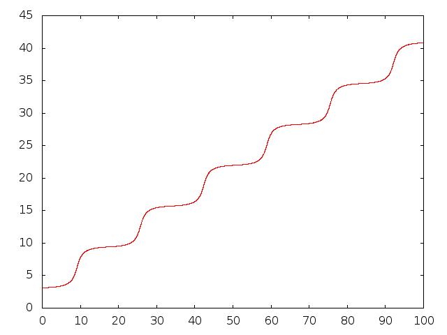

# Final for phys2200

The first problem is to approximate the volume of 5-dimensional superellipsoids with exponents of 1 through 9 
using the monte carlo method. 
Below is a graph of the volume of the superellipsoid vs. the exponent, n.

The second problem is to find the critical value of omega at which the oscillation of a pendulum becomes unstable.
Omega is a parameter in the ordinary differential equations describing the motion of the pendulum. It is equivalent to 
the frequency of oscillation of the pendulum divided by the frequency of the pendulum's natural oscillations.
Below are stable and unstable plots of phi vs. tau for omega = 175 and omega = 125.

The third problem is to estimate the value of pi^4/90 with relative error less than 3 times machine epsilon.
